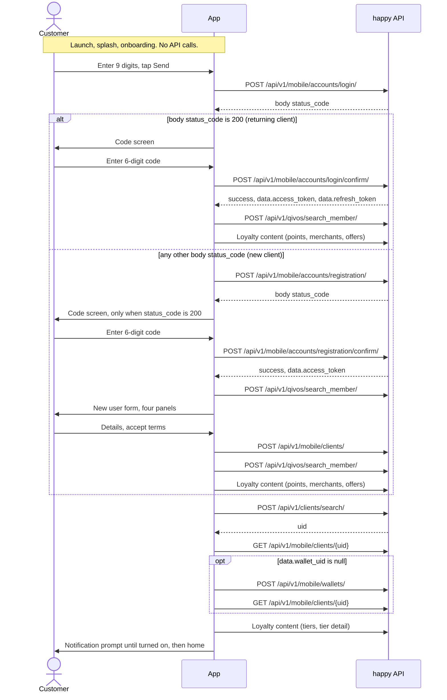

# Connecting your login and sign-up screens to the backend

This guide takes you from a screen that does nothing to a signed-in customer on the home screen. Follow it from top to bottom. Every step builds on the one before.

## 1. What you need before you start

### The two values

```
Base URL:      https://happy-stage.aws.neofin.global
Static token:  ask Ersi, it is handed out through the password manager and is never written in this repository
```

- These are shared credentials for the **test environment only**.
- Never commit them to a repository, never paste them into an issue or a chat, and never show them in a screenshot.
- In section 2.2 you put them in a file that stays on your machine. They go nowhere else.
- This file is public. That is why the token is not written here.

### What you will build

- The customer types a phone number and gets a code by SMS.
- A returning customer types the code and lands on home.
- A new customer types the code, fills in the sign-up form, and then lands on home.

Two things to know before you start:

- **The flow ends at the home screen.** Once the customer is there, sign-in is done.
- **There is no verification step.** You will not find an identity check or a "verified" flag anywhere in this flow. Do not go looking for one.

You also need your Flutter project with the login and sign-up screens already built. This guide only connects them to the backend.

## 2. Setup, once

You do this section once. Every step in section 3 uses what you build here.

### 2.1 Add the packages

The original app uses dio 5 for HTTP and flutter_secure_storage 9 for tokens. Use the same major versions so the code below works as written:

```sh
flutter pub add dio:^5.8.0 flutter_secure_storage:^9.2.4
```

### 2.2 Keep the two values out of your code

Create `env/test.json` in your project:

```json
{
  "BASE_URL": "copy the base URL from section 1",
  "STATIC_TOKEN": "copy the static token from section 1"
}
```

Add this line to your `.gitignore`, and check it before your first commit:

```
env/
```

Run the app with:

```sh
flutter run --dart-define-from-file=env/test.json
```

Paste the base URL exactly as you were given it. Every path in this guide starts with `/` and is added straight after it.

The values end up inside the app you build, so do not share test builds outside the team.

Create `lib/api/env.dart`:

```dart
// lib/api/env.dart
const String kBaseUrl = String.fromEnvironment('BASE_URL');
const String kStaticToken = String.fromEnvironment('STATIC_TOKEN');
```

### 2.3 Where the tokens live

When a code is confirmed, the backend gives you two tokens:

- an **access token**, which you send on the calls that need a signed-in customer
- a **refresh token**, which gets you a new access token when the old one stops working

Keep both in secure storage, never in plain preferences. How long each token lasts has not been documented yet, so do not build anything that depends on a lifetime. Section 2.4 handles expiry for you.

```dart
// lib/api/token_store.dart
import 'package:flutter_secure_storage/flutter_secure_storage.dart';

class TokenStore {
  TokenStore._();
  static final TokenStore instance = TokenStore._();

  static const _storage = FlutterSecureStorage();
  static const _accessKey = 'access_token';
  static const _refreshKey = 'refresh_token';

  Future<String?> readAccess() => _storage.read(key: _accessKey);

  Future<String?> readRefresh() => _storage.read(key: _refreshKey);

  Future<void> saveBoth({
    required String access,
    required String refresh,
  }) async {
    await _storage.write(key: _accessKey, value: access);
    await _storage.write(key: _refreshKey, value: refresh);
  }

  Future<void> saveAccess(String access) =>
      _storage.write(key: _accessKey, value: access);

  Future<void> clear() async {
    await _storage.delete(key: _accessKey);
    await _storage.delete(key: _refreshKey);
  }
}
```

### 2.4 The shared API client

**Two kinds of call.** Every call sends the same default headers. What changes is the `Authorization` header:

| Kind | Authorization header | Used for |
|---|---|---|
| Static | `Token <static token>` | asking for codes, confirming codes, finding the client id, refreshing |
| Customer | `Bearer <access token>` | member lookup, creating the client, loading the client, creating the wallet |

**The default headers.** They are copied from the original app. Send them exactly like this:

| Header | Value |
|---|---|
| `Content-Type` | `application/json` |
| `User-Agent` | `PostmanRuntime/7.36.0` |
| `Accept` | `*/*` |
| `Accept-Encoding` | `gzip, deflate, br` |
| `Connection` | `keep-alive` |

Nobody has confirmed yet whether the backend needs that `User-Agent`. Keep sending it until you hear otherwise.

**What this client does:**

- It never throws because of an HTTP status. Each step reads the answer and decides for itself.
- It has timeouts. The backend's own limits are not documented, so agree the values with your team.
- When a customer call gets HTTP 401, it asks for a new access token once and repeats the call once. Several calls failing at the same moment share that one refresh.
- The refresh goes through its own dio instance, apart from the calls it rescues.
- If the refresh fails, it clears both tokens and calls `onSessionExpired`. That is where you send the customer back to the phone screen.
- It throws `NetworkException` only when no answer came back at all, for example no connection or a timeout.
- It does not log tokens or headers. Keep it that way.

**The refresh call it makes:**

- `POST /api/v1/mobile/accounts/token/refresh/` with the static token
- body: `refresh_token`, the refresh token you stored
- a good answer is HTTP 200 with a non-empty `data.access_token`, which replaces the stored access token
- the original app keeps the old refresh token; whether the backend also sends a new one has not been documented yet

```dart
// lib/api/api_client.dart
import 'package:dio/dio.dart';

import 'env.dart';
import 'token_store.dart';

/// Which Authorization header a call needs. See the table above.
enum Auth { staticToken, customer }

/// Thrown only when no answer came back: no connection, timeout.
class NetworkException implements Exception {
  NetworkException(this.message);
  final String message;

  @override
  String toString() => 'NetworkException: $message';
}

/// One answer from the backend. See section 2.5.
class ApiResponse {
  ApiResponse(this.httpStatus, this.body);

  final int httpStatus;

  /// The JSON body, or null when the body is not a JSON object.
  final Map<String, dynamic>? body;

  bool get isHttpOk => httpStatus >= 200 && httpStatus < 300;

  /// The original app reads the answer from the body only for these statuses.
  bool get hasBodyAnswer =>
      body != null &&
      (httpStatus == 200 || httpStatus == 400 || httpStatus == 404);

  /// The `status_code` field inside the body. Not the HTTP status.
  int? get bodyStatusCode {
    final value = body?['status_code'];
    return value is int ? value : null;
  }

  bool get success => body?['success'] == true;

  String? get errorId {
    final value = body?['id'];
    return value is String ? value : null;
  }

  Map<String, dynamic>? get data {
    final value = body?['data'];
    return value is Map<String, dynamic> ? value : null;
  }
}

class ApiClient {
  ApiClient._();
  static final ApiClient instance = ApiClient._();

  /// Set once in main(). Runs after the tokens are cleared.
  void Function()? onSessionExpired;

  static BaseOptions _options() => BaseOptions(
        connectTimeout: const Duration(seconds: 15),
        receiveTimeout: const Duration(seconds: 30),
        contentType: Headers.jsonContentType,
        headers: <String, String>{
          'User-Agent': 'PostmanRuntime/7.36.0',
          'Accept': '*/*',
          'Accept-Encoding': 'gzip, deflate, br',
          'Connection': 'keep-alive',
        },
        // Never throw on a status code. Each step decides.
        validateStatus: (_) => true,
      );

  final Dio _dio = Dio(_options());

  // Used for the refresh call only.
  final Dio _refreshDio = Dio(_options());

  Future<bool>? _refreshing;

  Future<ApiResponse> send(
    String method,
    String path, {
    required Auth auth,
    Map<String, dynamic>? body,
  }) async {
    var response = await _request(method, path, auth, body);
    if (response.httpStatus != 401 || auth != Auth.customer) {
      return response;
    }
    if (await _refreshOnce()) {
      response = await _request(method, path, auth, body);
      if (response.httpStatus != 401) {
        return response;
      }
    }
    await TokenStore.instance.clear();
    onSessionExpired?.call();
    return response;
  }

  Future<ApiResponse> _request(
    String method,
    String path,
    Auth auth,
    Map<String, dynamic>? body,
  ) async {
    final authorization = await _authorization(auth);
    try {
      final response = await _dio.request<dynamic>(
        '$kBaseUrl$path',
        data: body,
        options: Options(
          method: method,
          headers: <String, String>{'Authorization': authorization},
        ),
      );
      return ApiResponse(response.statusCode ?? 0, _jsonObject(response.data));
    } on DioException catch (e) {
      throw NetworkException(e.message ?? e.type.name);
    }
  }

  Future<String> _authorization(Auth auth) async {
    if (auth == Auth.staticToken) {
      return 'Token $kStaticToken';
    }
    final token = await TokenStore.instance.readAccess();
    if (token == null || token.isEmpty) {
      throw StateError('No access token. Confirm a code first.');
    }
    return 'Bearer $token';
  }

  Future<bool> _refreshOnce() {
    return _refreshing ??= _refresh().whenComplete(() => _refreshing = null);
  }

  Future<bool> _refresh() async {
    final refreshToken = await TokenStore.instance.readRefresh();
    if (refreshToken == null || refreshToken.isEmpty) {
      return false;
    }
    try {
      final response = await _refreshDio.post<dynamic>(
        '$kBaseUrl/api/v1/mobile/accounts/token/refresh/',
        data: <String, dynamic>{'refresh_token': refreshToken},
        options: Options(
          headers: <String, String>{'Authorization': 'Token $kStaticToken'},
        ),
      );
      final data = _jsonObject(response.data)?['data'];
      final access = data is Map<String, dynamic> ? data['access_token'] : null;
      if (response.statusCode == 200 && access is String && access.isNotEmpty) {
        await TokenStore.instance.saveAccess(access);
        return true;
      }
      return false;
    } on DioException {
      return false;
    }
  }

  static Map<String, dynamic>? _jsonObject(Object? value) =>
      value is Map<String, dynamic> ? value : null;
}
```

Wire up the session-expired callback once, in `main`:

```dart
// lib/main.dart (excerpt)
import 'package:flutter/material.dart';

import 'api/api_client.dart';
import 'api/env.dart';

void main() {
  assert(
    kBaseUrl.isNotEmpty && kStaticToken.isNotEmpty,
    'Run with --dart-define-from-file=env/test.json',
  );
  ApiClient.instance.onSessionExpired = () {
    // Send the customer back to your phone screen here.
  };
  runApp(const MyApp());
}
```

**At launch.** The original app never skips login: every launch starts at the phone screen, even when tokens are stored. Whether your app should skip login when it finds tokens is a product decision. Ask Ersi before you build it.

### 2.5 How to read an answer

Most answers have this shape:

```json
{
  "success": true,
  "status_code": 200,
  "data": { },
  "message": "...",
  "id": "..."
}
```

- `success` is the usual yes or no.
- `status_code` is a number **inside the body**. It is not the HTTP status, and the original app makes its decisions on this number. Whether it always matches the HTTP status has not been confirmed, so do what the steps below do.
- `data` holds the part you need.
- `id` names an error. The only error name known so far is `user_already_exists`.
- `message` is never shown to the customer by the original app.

Two calls use a different shape: the member lookup (step 6) and the client id lookup (step 8). Their steps show it.

**Rules the steps follow:**

- An HTTP 400 or 404 is never a success, even when it has a body. The steps still read the body of a 400 or 404, because the original app does, and a refusal such as `user_already_exists` may arrive that way.
- Where nobody knows which success status the backend returns, the steps accept any 2xx (`isHttpOk`).
- Every example awaits its call and handles `NetworkException`. Always await your calls and handle their errors in your own code.

What the backend sends when something goes wrong has not been documented beyond what each step says. Where a step says "not documented yet", show a general error and tell Ersi what you saw.

### 2.6 The phone number

Every call sends the number as `+355` followed by 9 digits. The original app removes a leading `0` and accepts exactly 9 digits after that. Only Albanian numbers are supported.

```dart
// lib/api/phone.dart

/// Returns +355 followed by 9 digits, or null if the input is not valid.
String? toApiPhone(String typed) {
  var digits = typed.replaceAll(RegExp(r'[^0-9]'), '');
  if (digits.startsWith('0')) {
    digits = digits.substring(1);
  }
  return digits.length == 9 ? '+355$digits' : null;
}
```

Keep the Send button disabled until `toApiPhone` returns a value.

## 3. The calls, in order

### The flow at a glance



How to read the diagram:

- **Client** is the backend's word for a customer record.
- The diagram shows the original app. It stores only the access token after a sign-up confirm; you will store both tokens (step 5).
- The "Loyalty content" calls load points and offers for the home screen. **You do not need them to reach home**, and this guide does not cover them.
- There are two ways through: a **returning customer** (steps 1, 3, 4, 6, then 8 to 11) and a **new customer** (steps 1, 2, 3, 5, 6, 7, then 8 to 11).

All the step functions below go in one file, `lib/api/auth_api.dart`, which starts like this:

```dart
// lib/api/auth_api.dart
import 'api_client.dart';
import 'token_store.dart';

final _api = ApiClient.instance;

/// Which way the customer is going. Keep it for the whole sign-in.
enum AuthMode { login, registration }
```

In the screen examples, `openCodeScreen`, `showError`, `clearError` and similar names stand for your own navigation and error UI.

### Step 1. Ask for a login code

**What it does.** It asks the backend to text a login code to the number. The answer also tells you whether the number belongs to an existing customer. Fire it when the customer taps Send.

**Request.** `POST /api/v1/mobile/accounts/login/`, static headers.

| Field | What it is | Valid value |
|---|---|---|
| `mobile_number` | the customer's number | `+355` followed by 9 digits, for example `+355XXXXXXXXX` |

**Response.** Check one field:

| Field | Check |
|---|---|
| `status_code` (in the body) | `200` means an existing customer and the code is on its way |

```dart
Future<ApiResponse> requestLoginCode(String phone) {
  return _api.send(
    'POST',
    '/api/v1/mobile/accounts/login/',
    auth: Auth.staticToken,
    body: {'mobile_number': phone},
  );
}
```

**Before you call it,** clear any stored tokens. A new sign-in must never start with tokens left from an earlier one. The combined function in step 2 does this for you.

**Next.**

- **HTTP 2xx and body `status_code` 200:** open the code screen in login mode.
- **Any other answer with a body (HTTP 200, 400 or 404):** go to step 2. This is what the original app does. What the backend sends here for a new number has not been documented beyond "not 200".
- **No readable answer** (another HTTP status, no body, or `NetworkException`): stop and show an error. Do not go to step 2.

**Watch out.**

- Show an error for every failure. The original app shows nothing on the phone screen.
- Disable Send while the request runs, so a double tap does not send two codes.

### Step 2. Ask for a registration code

**What it does.** It asks the backend to text a sign-up code to a number that is not an existing customer. Fire it only after step 1 answered with something other than 200.

**Request.** `POST /api/v1/mobile/accounts/registration/`, static headers.

| Field | What it is | Valid value |
|---|---|---|
| `mobile_number` | the customer's number | `+355` followed by 9 digits |

**Response.** Check two fields:

| Field | Check |
|---|---|
| `status_code` (in the body) | `200` means a new customer and the code is on its way |
| `id` | together with `status_code` 400, `user_already_exists` means the number is already registered |

```dart
Future<ApiResponse> requestRegistrationCode(String phone) {
  return _api.send(
    'POST',
    '/api/v1/mobile/accounts/registration/',
    auth: Auth.staticToken,
    body: {'mobile_number': phone},
  );
}
```

**Steps 1 and 2 together.** Your Send button calls this:

```dart
enum SendCodeResult { codeSent, alreadyRegistered, failed }

class SendCodeOutcome {
  SendCodeOutcome(this.result, [this.mode]);
  final SendCodeResult result;
  final AuthMode? mode;
}

Future<SendCodeOutcome> sendFirstCode(String phone) async {
  await TokenStore.instance.clear();

  final login = await requestLoginCode(phone);
  if (login.isHttpOk && login.bodyStatusCode == 200) {
    return SendCodeOutcome(SendCodeResult.codeSent, AuthMode.login);
  }
  if (!login.hasBodyAnswer) {
    return SendCodeOutcome(SendCodeResult.failed);
  }

  final registration = await requestRegistrationCode(phone);
  if (registration.isHttpOk && registration.bodyStatusCode == 200) {
    return SendCodeOutcome(SendCodeResult.codeSent, AuthMode.registration);
  }
  if (registration.hasBodyAnswer &&
      registration.bodyStatusCode == 400 &&
      registration.errorId == 'user_already_exists') {
    return SendCodeOutcome(SendCodeResult.alreadyRegistered);
  }
  return SendCodeOutcome(SendCodeResult.failed);
}
```

And in your phone screen's `State`:

```dart
Future<void> onSendPressed() async {
  final phone = toApiPhone(phoneController.text);
  if (phone == null || sending) return;
  setState(() => sending = true);
  try {
    final outcome = await sendFirstCode(phone);
    switch (outcome.result) {
      case SendCodeResult.codeSent:
        openCodeScreen(phone: phone, mode: outcome.mode!);
      case SendCodeResult.alreadyRegistered:
        showError('This number is already registered.');
      case SendCodeResult.failed:
        showError('We could not send a code. Please try again.');
    }
  } on NetworkException {
    showError('No connection. Please try again.');
  } finally {
    if (mounted) setState(() => sending = false);
  }
}
```

**Next.**

- **Code sent:** open the code screen and pass it the phone number and the mode. Keep the mode for the whole sign-in. Never work it out again from older answers.
- **Already registered:** show a message and stay on the phone screen. Step 1 has just said the number is not an existing customer, so this means the two calls disagree. Tell Ersi if you see it.
- **Anything else:** show an error. Other refusal answers have not been documented yet.

**Watch out.** The original app does nothing at all for "already registered". Always tell the customer.

### Step 3. The code screen: countdown and resend

**What it does.** Nothing new on the backend. Resend repeats step 1 in login mode or step 2 in sign-up mode. There is no separate resend call.

- The original app shows a 30-second countdown before resend. That number is the app's own choice. How long a code stays valid on the server, how many attempts it allows, and whether it enforces a resend wait have not been documented yet.
- Start the countdown when the screen opens, because a code was just sent.

```dart
// In your code screen's State. Needs: import 'dart:async';
static const resendDelay = 30;
int secondsLeft = resendDelay;
Timer? countdown;

@override
void initState() {
  super.initState();
  startCountdown();
}

void startCountdown() {
  countdown?.cancel();
  setState(() => secondsLeft = resendDelay);
  countdown = Timer.periodic(const Duration(seconds: 1), (timer) {
    if (secondsLeft <= 1) {
      timer.cancel();
      setState(() => secondsLeft = 0);
    } else {
      setState(() => secondsLeft--);
    }
  });
}

Future<void> onResendPressed() async {
  if (secondsLeft > 0) return;
  try {
    final response = widget.mode == AuthMode.login
        ? await requestLoginCode(widget.phone)
        : await requestRegistrationCode(widget.phone);
    if (response.isHttpOk && response.bodyStatusCode == 200) {
      clearError();
      startCountdown();
    } else {
      showError('We could not send a new code. Please try again.');
    }
  } on NetworkException {
    showError('No connection. Please try again.');
  }
}

@override
void dispose() {
  countdown?.cancel();
  super.dispose();
}
```

**Watch out.**

- Make the resend button do nothing until the countdown ends. The original app only greys it out.
- Run one countdown at a time, and restart it only after a code was actually sent.
- Clear the old error message when a new code goes out.
- Resend exactly the same call as the first send, chosen by the mode you stored.

### Step 4. Confirm the login code (returning customer)

**What it does.** It exchanges the code for the two tokens. Fire it when the customer has typed all 6 digits, in login mode.

**Request.** `POST /api/v1/mobile/accounts/login/confirm/`, static headers.

| Field | What it is | Valid value |
|---|---|---|
| `mobile_number` | the same number as step 1 | `+355` followed by 9 digits |
| `otp_code` | the code the customer typed | exactly 6 digits, sent as text, for example `"123456"` |

**Response.** Check these fields:

| Field | Check |
|---|---|
| `success` | must be `true` |
| `data.access_token` | must not be empty; store it |
| `data.refresh_token` | store it |

```dart
enum ConfirmResult { confirmed, rejected, failed }

Future<ConfirmResult> _confirm(String path, String phone, String code) async {
  final response = await _api.send(
    'POST',
    path,
    auth: Auth.staticToken,
    body: {'mobile_number': phone, 'otp_code': code},
  );
  final access = response.data?['access_token'];
  final refresh = response.data?['refresh_token'];
  if (response.isHttpOk &&
      response.success &&
      access is String &&
      access.isNotEmpty) {
    await TokenStore.instance.saveBoth(
      access: access,
      refresh: refresh is String ? refresh : '',
    );
    return ConfirmResult.confirmed;
  }
  return response.hasBodyAnswer
      ? ConfirmResult.rejected
      : ConfirmResult.failed;
}

Future<ConfirmResult> confirmLoginCode(String phone, String code) {
  return _confirm('/api/v1/mobile/accounts/login/confirm/', phone, code);
}
```

**Next.**

- **Confirmed:** go to step 6, then steps 8 to 11. Show a loader while they run.
- **Rejected:** the code was wrong, or it expired, or the backend refused for another reason. **You cannot tell these apart.** The backend's answers for a wrong code, an expired code and too many attempts have not been documented yet. Show one message that covers them. The original app uses: "Something went wrong. Check your phone number and resend the code to try again."
- **Failed or `NetworkException`:** show a general error and let the customer try again. How the backend signals "too many requests" has not been documented yet.

**Watch out.**

- A failure in a later step (6, 8, 9 or 10) is not a code problem. Show a different message for it. The original app shows the code error even when the code was accepted and the tokens were already stored.
- Show a loader while the confirm is running.

### Step 5. Confirm the registration code (new customer)

**What it does.** The same exchange as step 4, for a new customer. Fire it when the customer has typed all 6 digits, in sign-up mode.

**Request.** `POST /api/v1/mobile/accounts/registration/confirm/`, static headers. Same body as step 4:

| Field | What it is | Valid value |
|---|---|---|
| `mobile_number` | the same number as step 2 | `+355` followed by 9 digits |
| `otp_code` | the code the customer typed | exactly 6 digits, sent as text |

**Response.** The same fields as step 4: `success` must be `true`, and `data.access_token` must not be empty. Store `data.access_token` and `data.refresh_token`.

```dart
Future<ConfirmResult> confirmRegistrationCode(String phone, String code) {
  return _confirm(
    '/api/v1/mobile/accounts/registration/confirm/',
    phone,
    code,
  );
}
```

**Next.**

- **Confirmed:** go to step 6, then open the sign-up form.
- **Rejected or failed:** show the same messages as step 4.

**Watch out.**

- **Tell the customer when the code fails.** The original app shows nothing at all on this path, not for a wrong code, not for an expired one, and not for a server error.
- **Store the refresh token here too.** The original app keeps only the access token after sign-up, so a new customer cannot refresh their session.
- If something fails, stay in sign-up mode. The original app can fall back to login mode after an error. Use the mode you stored in step 2.

### Step 6. Look up the loyalty member

**What it does.** It fetches the customer's loyalty record for this number. You use it to pre-fill the sign-up form and to get the loyalty code for step 7. Fire it right after step 4 or step 5 succeeds. In sign-up mode, fire it again after step 7.

**Request.** `POST /api/v1/qivos/search_member/`, customer headers.

| Field | What it is | Valid value |
|---|---|---|
| `mobile_number` | the customer's number | `+355` followed by 9 digits |
| `page` | the result page | always `1` |
| `page_size` | results per page | always `100` |

**Response.** This call has its own shape, and its field names use camelCase:

```json
{
  "response": {
    "success": true,
    "payload": {
      "data": [ { "QCCode": "...", "firstName": "...", "...": "..." } ]
    }
  }
}
```

| Field | Check or use |
|---|---|
| `response.success` | must be `true` |
| `response.payload.data` | a member is found only when this list is not empty; use the first entry |
| `QCCode` | the loyalty code; note the capital `QC`; send it in step 7 |
| `firstName`, `lastName` | pre-fill the form |
| `gender` | pre-fill the form; the original app ignores letter case when it reads this |
| `dateOfBirth` | pre-fill the form; a date string |
| `addressList[0].town`, `addressList[0].addressLine1`, `addressList[0].postCode` | pre-fill city, street and post code; the original app does not fix a type for the last two, so read them as text |
| `emailList[0].emailAddress` | pre-fill email |
| `loyaltyMembershipData[0].pointBalance` | the points shown on home |

```dart
class MemberLookup {
  const MemberLookup({this.member, this.failed = false});

  /// The first member entry, or null when no member was found.
  final Map<String, dynamic>? member;

  /// True when there was no readable answer at all.
  final bool failed;

  bool get found => member != null;
}

Future<MemberLookup> findMember(String phone) async {
  final response = await _api.send(
    'POST',
    '/api/v1/qivos/search_member/',
    auth: Auth.customer,
    body: {'mobile_number': phone, 'page': 1, 'page_size': 100},
  );
  if (!response.hasBodyAnswer) {
    return const MemberLookup(failed: true);
  }
  final result = response.body?['response'];
  if (!response.isHttpOk ||
      result is! Map<String, dynamic> ||
      result['success'] != true) {
    return const MemberLookup();
  }
  final payload = result['payload'];
  final list = payload is Map<String, dynamic> ? payload['data'] : null;
  final first = list is List && list.isNotEmpty ? list.first : null;
  return first is Map<String, dynamic>
      ? MemberLookup(member: first)
      : const MemberLookup();
}

/// Values to pre-fill the sign-up form. Any of them can be null.
class MemberPrefill {
  MemberPrefill.fromMember(Map<String, dynamic> m)
      : qcCode = _text(m['QCCode']),
        firstName = _text(m['firstName']),
        lastName = _text(m['lastName']),
        gender = _text(m['gender']),
        dateOfBirth = DateTime.tryParse(_text(m['dateOfBirth']) ?? ''),
        city = _text(_first(m['addressList'])?['town']),
        street = _text(_first(m['addressList'])?['addressLine1']),
        postCode = _text(_first(m['addressList'])?['postCode']),
        email = _text(_first(m['emailList'])?['emailAddress']),
        points = _int(_first(m['loyaltyMembershipData'])?['pointBalance']);

  final String? qcCode;
  final String? firstName;
  final String? lastName;
  final String? gender;
  final DateTime? dateOfBirth;
  final String? city;
  final String? street;
  final String? postCode;
  final String? email;
  final int? points;

  static String? _text(Object? value) => value?.toString();

  static int? _int(Object? value) => value is int ? value : null;

  static Map<String, dynamic>? _first(Object? list) {
    if (list is List && list.isNotEmpty) {
      final first = list.first;
      if (first is Map<String, dynamic>) return first;
    }
    return null;
  }
}
```

**Next.**

- **Login mode, member found:** go to step 8.
- **Login mode, no member or failed:** stop and show an error. The original app does not let a returning customer continue without a member record.
- **Sign-up mode, right after step 5:** open the sign-up form either way. Pre-fill it when a member was found, and start empty when none was.
- **Sign-up mode, after step 7:** continue to step 8 when a member is found. Otherwise show an error: the client already exists at this point, so let the customer retry this step rather than step 7.
- What the backend sends when this lookup fails has not been documented yet.

**Watch out.**

- The member record carries a second loyalty code, `loyaltyMembershipData[0].QCCode`. Do not assume it equals the top-level `QCCode`. Step 7 uses the top-level one.
- Keep the member you found for the whole sign-in. The original app loses it after an error, and a retry then sends an empty loyalty code.

### Step 7. Create the client (new customer only)

**What it does.** It creates the new customer's record on the backend. Fire it when the customer taps Continue on the last page of the sign-up form.

**Request.** `POST /api/v1/mobile/clients/`, customer headers. Send all ten fields every time.

| Field | What it is | Valid value |
|---|---|---|
| `mobile_number` | the customer's number | `+355` followed by 9 digits |
| `first_name` | first name | not empty |
| `last_name` | last name | not empty |
| `gender` | gender | see the note below |
| `date_of_birth` | date of birth | year, month and day joined by `-`, without leading zeros, for example `1990-5-3`; the customer must be 18 or older |
| `address` | street | not empty; the screen calls it street, the backend calls it `address` |
| `town` | city | not empty; the screen calls it city, the backend calls it `town` |
| `post_code` | post code | not empty |
| `email` | email | optional; send `null` when the customer leaves it empty |
| `qc_code` | loyalty code | `QCCode` from step 6, or an empty string `""` when no member was found |

These checks are the original app's own. The backend's rules have not been documented, so treat them as the minimum.

- **Gender.** The original app sends the label shown on screen, in lowercase: `male` or `female` in English, but `mashkull` or `femër` in Albanian. Which values the backend accepts has not been confirmed. Send `male` or `female` whatever language the screen uses, and ask Ersi to confirm before you release.
- **Date format.** The original app sends the date without leading zeros, as shown above. Whether `1990-05-03` is also accepted has not been confirmed. Send it the way the original app does.
- **Apartment.** The original app collects an apartment number but never sends it, and this call has no field for it. If your design has an apartment field, ask Ersi before you send it anywhere.
- **Terms and promotions.** The terms checkbox and the promotions choice are not sent either. The terms checkbox only has to be ticked before Continue works.

```dart
String apiDateOfBirth(DateTime date) =>
    '${date.year}-${date.month}-${date.day}';

bool isAdult(DateTime birth, {DateTime? today}) {
  final now = today ?? DateTime.now();
  var age = now.year - birth.year;
  if (now.month < birth.month ||
      (now.month == birth.month && now.day < birth.day)) {
    age--;
  }
  return age >= 18;
}

Future<bool> createClient({
  required String phone,
  required String firstName,
  required String lastName,
  required String gender,
  required DateTime dateOfBirth,
  required String street,
  required String city,
  required String postCode,
  String? email,
  String qcCode = '',
}) async {
  final response = await _api.send(
    'POST',
    '/api/v1/mobile/clients/',
    auth: Auth.customer,
    body: {
      'mobile_number': phone,
      'first_name': firstName,
      'last_name': lastName,
      'gender': gender,
      'date_of_birth': apiDateOfBirth(dateOfBirth),
      'address': street,
      'town': city,
      'post_code': postCode,
      'email': email,
      'qc_code': qcCode,
    },
  );
  return response.isHttpOk && response.success;
}
```

**Response.** Check `success`, which must be `true`, and an HTTP status in the 2xx range. The original app accepts only HTTP 200. Whether the backend answers 200 or 201 has not been confirmed, so accept any 2xx.

**Next.**

- **Success:** run step 6 again, then steps 8 to 11. Show a loader.
- **Failure:** show an error and keep the form filled in. The backend's validation messages have not been documented yet.
- **`NetworkException`:** show a connection error.

**Watch out.**

- Disable Continue while the request runs, and do not send it twice. What the backend does with a second create for the same number has not been documented yet.
- If a retry is needed, send the same `qc_code` as the first attempt.

### Step 8. Find the client id

**What it does.** It turns the phone number into the customer's client id (`uid`), which steps 9 and 10 need. Fire it right after step 6, in both modes.

**Request.** `POST /api/v1/clients/search/`, **static** headers, even though the customer is signed in. Note that this path has no `/mobile/` in it.

| Field | What it is | Valid value |
|---|---|---|
| `mobile_number` | the customer's number | `+355` followed by 9 digits |

**Response.** A plain object, with no `success` or `data`:

```json
{ "uid": "..." }
```

It can carry other fields. You only need `uid`.

| Field | Check |
|---|---|
| `uid` | must not be empty; keep it for steps 9 and 10 |

```dart
Future<String?> findClientUid(String phone) async {
  final response = await _api.send(
    'POST',
    '/api/v1/clients/search/',
    auth: Auth.staticToken,
    body: {'mobile_number': phone},
  );
  final uid = response.body?['uid'];
  return response.isHttpOk && uid is String && uid.isNotEmpty ? uid : null;
}
```

**Next.**

- **You have a `uid`:** go to step 9.
- **No `uid`:** stop and show an error. What the backend sends for a number it does not know has not been documented yet.

**Watch out.** Never call step 9 with an empty `uid`. The original app does, and nobody knows what that request returns.

### Step 9. Load the client

**What it does.** It fetches the customer's record, which tells you whether they already have a wallet. Fire it right after step 8, and again after step 10 creates a wallet.

**Request.** `GET /api/v1/mobile/clients/{uid}`, customer headers, no body. Put the `uid` from step 8 at the end, with **no slash after it**.

**Response.** Check these fields:

| Field | Check |
|---|---|
| `success` | must be `true` |
| `data.wallet_uid` | `null` means the customer has no wallet yet; go to step 10 |

```dart
Future<Map<String, dynamic>?> loadClient(String uid) async {
  final response = await _api.send(
    'GET',
    '/api/v1/mobile/clients/$uid',
    auth: Auth.customer,
  );
  return response.isHttpOk && response.success ? response.data : null;
}
```

**Next.**

- **`wallet_uid` has a value:** go to step 11.
- **`wallet_uid` is null:** go to step 10.
- **No record, `success` not true, or an error:** stop and show an error. The original app shows nothing here and leaves the customer stuck. What the backend sends on failure has not been documented yet.

**Watch out.** The record also carries personal details under `data.extra_data`. You do not need them for sign-in. If you do read them, do not let an unexpected date format break the step.

### Step 10. Create a wallet (only if the client has none)

**What it does.** It creates the customer's wallet. Fire it only when step 9 returned `wallet_uid` as null. After it succeeds, run step 9 again.

**Request.** `POST /api/v1/mobile/wallets/`, customer headers.

| Field | What it is | Valid value |
|---|---|---|
| `owner_uid` | who owns the wallet | the `uid` from step 8 |
| `type` | wallet type | always `INDIVIDUAL` |
| `extra.mobile_number` | the customer's number, inside an `extra` object | `+355` followed by 9 digits |

The body looks like this:

```json
{
  "owner_uid": "...",
  "type": "INDIVIDUAL",
  "extra": { "mobile_number": "+355XXXXXXXXX" }
}
```

**Response.** Check `success`, which must be `true`, and an HTTP status in the 2xx range. Whether the backend answers 200 or 201 has not been confirmed.

```dart
Future<bool> createWallet({
  required String clientUid,
  required String phone,
}) async {
  final response = await _api.send(
    'POST',
    '/api/v1/mobile/wallets/',
    auth: Auth.customer,
    body: {
      'owner_uid': clientUid,
      'type': 'INDIVIDUAL',
      'extra': {'mobile_number': phone},
    },
  );
  return response.isHttpOk && response.success;
}
```

**Steps 8 to 10 together.** Call this after step 6, in both modes:

```dart
enum FinishResult { ready, noClient, noWallet }

Future<FinishResult> finishSignIn(String phone) async {
  final uid = await findClientUid(phone);
  if (uid == null) return FinishResult.noClient;

  var client = await loadClient(uid);
  if (client == null) return FinishResult.noClient;

  if (client['wallet_uid'] == null) {
    final created = await createWallet(clientUid: uid, phone: phone);
    if (!created) return FinishResult.noWallet;
    client = await loadClient(uid);
    if (client == null) return FinishResult.noClient;
  }
  return FinishResult.ready;
}
```

**Next.**

- **Ready:** go to step 11.
- **No wallet:** the original app lets the customer continue to home without a wallet. Ask Ersi whether yours should do the same, or show an error and offer a retry.
- **No client:** show an error.

**Watch out.** If you read the wallet's `balance` from the response, accept any number, whole or decimal. Its exact type has not been documented. The original app declares it as a decimal. We think a whole number would break the original app's parsing, but nobody has tested that.

### Step 11. Arrive on home

**What it does.** Nothing on the backend. The customer is signed in.

- The original app shows a notification permission prompt first, until notifications are turned on. That is a screen choice, not a backend call.
- The original app also loads loyalty content (points history, partners, offers, tiers) before home. You do not need it for sign-in.

**Watch out.** Never let loyalty content stop the customer from reaching home. In the original app, a failure in those calls blocks home completely.

## 4. Checklist

1. [ ] Shared client sends the default headers, has timeouts, and refreshes once on 401: `POST /api/v1/mobile/accounts/token/refresh/`
2. [ ] Clear stored tokens, then ask for a login code: `POST /api/v1/mobile/accounts/login/`
3. [ ] If the answer is not 200, ask for a registration code: `POST /api/v1/mobile/accounts/registration/`
4. [ ] Resend only after the countdown ends, with the same call as the first send
5. [ ] Returning customer: confirm the code and store both tokens: `POST /api/v1/mobile/accounts/login/confirm/`
6. [ ] New customer: confirm the code and store both tokens: `POST /api/v1/mobile/accounts/registration/confirm/`
7. [ ] Look up the member: `POST /api/v1/qivos/search_member/`
8. [ ] New customer: create the client, then look up the member again: `POST /api/v1/mobile/clients/`
9. [ ] Find the client id: `POST /api/v1/clients/search/`
10. [ ] Load the client: `GET /api/v1/mobile/clients/{uid}`
11. [ ] If `wallet_uid` is null, create the wallet and load the client again: `POST /api/v1/mobile/wallets/`
12. [ ] Open home, without waiting for loyalty content
